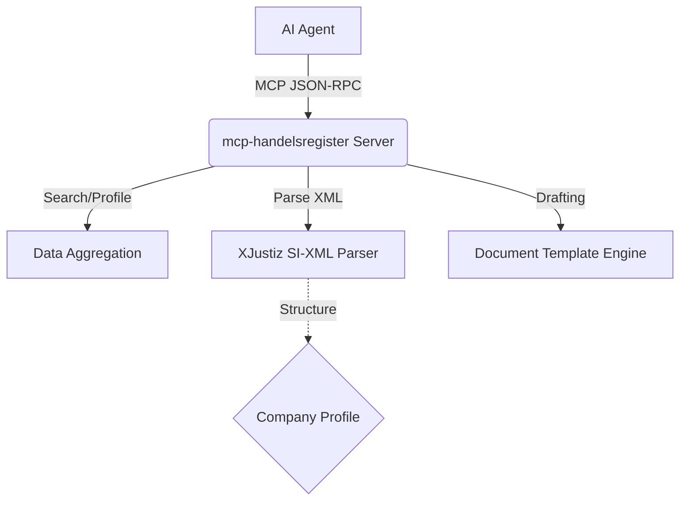

# mcp-handelsregister

> Das Handelsregister ist das Fundament der deutschen Wirtschaft. Dieser MCP-Server macht es für KI-Agenten zugänglich.

10 Millionen Unternehmen. 16 Landesregister. Null APIs. Bis jetzt.

`mcp-handelsregister` schließt die Lücke zwischen den statischen, schwer zugänglichen Daten des deutschen Handelsregisters und der dynamischen Welt der KI-Agenten. Er bietet strukturierte Suchen, XJustiz XML-Parsing und automatisierte Entwurf-Generierung für agenten-basierte Workflows.

## Why This Matters

Das Handelsregister ist die kritischste B2B-Datenquelle in Deutschland. Für KI-Agenten, die im B2B-Umfeld agieren, ist strukturierter Zugriff unerlässlich für:
- **KYC & Onboarding**: Automatische Verifizierung von Vertretungsberechtigungen.
- **Due Diligence & M&A**: Analyse von Gesellschafterstrukturen und Historien.
- **Compliance**: Überwachung von Registeränderungen (z.B. Geschäftsführerwechsel).

Das offizielle Portal (handelsregister.de) ist durch CAPTCHAs geschützt und rate-limitiert (~60 Requests/Stunde), ohne offizielle REST-API. `mcp-handelsregister` bietet eine standardisierte Schnittstelle (MCP) zur nahtlosen Integration in KI-Agenten.

## Architecture



## Features

- `search_company`: Firmensuche nach Name, Sitz, Registergericht oder Nummer.
- `get_company_profile`: Strukturiertes Profil (Firma, Rechtsform, Geschäftsführer, Kapital).
- `get_register_extract`: Abruf von aktuellen und historischen Registerabzügen.
- `parse_xjustiz`: Konvertierung des offiziellen XJustiz SI-XML in saubere TypeScript-Typen.
- `draft_articles`: Generierung von Dokumentenentwürfen (Gesellschaftsvertrag, Handelsregisteranmeldung).
- `monitor_company`: Webhook-basiertes Monitoring für Unternehmensänderungen.

## Code Examples

### Parsing XJustiz (SI-XML)

```typescript
const response = await mcp.callTool('parse_xjustiz', {
    xml: "<registerInhalt>...<firma>Muster GmbH</firma>...</registerInhalt>"
});
console.log(response.companyName); // "Muster GmbH"
```

### Drafting Articles

```typescript
const draft = await mcp.callTool('draft_articles', {
    documentType: "Gesellschaftsvertrag",
    companyName: "Agentic Commerce GmbH"
});
```

## Legal Constraints

> [!WARNING]
> Company registration **REQUIRES notarial certification (§ 12 HGB)**. Das Drafting-Tool erzeugt ausschließlich Entwürfe. Diese können nicht automatisch ohne Notar (z.B. über online.notar.de) eingereicht werden.

Weitere Details zur Rechtslage: [Legal Constraints](docs/legal-constraints.md).

## Comparison

Während kommerzielle Anbieter wie North Data oder Apify REST-APIs für menschliche Entwickler bereitstellen, ist `mcp-handelsregister` nativ als MCP (Model Context Protocol) Server für direkte KI-Agenten-Integration konzipiert.

---

**Teil des Agentic Commerce Stack von Matteo Ise:**

- [well-known-mcp](https://github.com/matteo-ise/well-known-mcp) — Discovery-Standard für KI-Agenten
- [agent-wallet-sdk](https://github.com/matteo-ise/agent-wallet-sdk) — Unified Payment Infrastructure für Agenten
- [agent-governance](https://github.com/matteo-ise/agent-governance) — Audit, Compliance & Human-Escalation
- [mcp-deutschland](https://github.com/matteo-ise/mcp-deutschland) — MCP-Server für ELSTER, DATEV, XRechnung
- [mcp-handelsregister](https://github.com/matteo-ise/mcp-handelsregister) — Deutsches Handelsregister für Agenten
- [agentic-commerce-sdk](https://github.com/matteo-ise/agentic-commerce-sdk) — Agent-to-Agent Commerce
- [agentic-maturity-model](https://github.com/matteo-ise/agentic-maturity-model) — Reifegrad-Framework (Stufe 0→5)
- [kontorstack](https://github.com/matteo-ise/kontorstack) — Full-Stack Framework für agentische Unternehmen

[Matteo Ise auf GitHub](https://github.com/matteo-ise) · [X/Twitter](https://x.com/matteoise)
